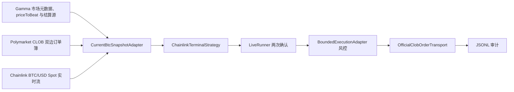

# BTC 5 分钟 Up/Down 实盘策略与文件地图

> 适用仓库：`/Users/gjy/polymarket-bot`
>
> 当前状态：BTC 版本已实现；本文记录当前受控实盘配置和实际实现，不把计划功能写成已完成。

## 1. 策略目标

交易 Polymarket 的 `Bitcoin Up or Down` 五分钟二元盘口。市场按 Chainlink BTC/USD 60 秒 TWAP 数据流结算：窗口结束时的价格不低于窗口起始价格则 `Up`，否则 `Down`。

机器人不预测 BTC 长期涨跌。它估计终局 TWAP 方向概率，比较可成交价格与手续费，并要求连续确认。BTC 额外使用 1.25 倍有效波动率重算概率，压力情景净优势也必须达到门槛。成交后不再直接退出，而是管理本会话仓位。

## 2. 当前实盘配置

当前受控实盘会话采用：

| 参数 | 当前值 | 含义 |
|---|---:|---|
| `quantity` | 5 份 | 信号方向在价格上限内必须具备的最低可成交深度；不是订单固定数量 |
| `max-order-debit` | 4 USDC | 单笔含手续费最大总支出 |
| `max-session-debit` | 4 USDC | 整个授权会话最大总支出 |
| `sample-seconds` | 2 秒 | 主循环观察间隔 |
| `required_signal_confirmations` | 2 次 | 相同市场、策略、方向必须由 2 个前进的官方源时间戳连续确认 |
| `minimum_terminal_probability` | 0.60 | 模型方向概率最低门槛 |
| `maximum_entry_price` | 0.75 | 允许成交的最高每份价格 |
| `volatility_floor_per_sqrt_second` | 0.00005 | 由已结算样本校准的每秒对数波动率下限 |
| `threshold` | 0.04 | 策略要求的最低净优势 |
| `monitor-seconds` | 86000 秒 | 会话监控上限；成交后容量耗尽，不会继续下注 |
| 订单类型 | FAK | 立即成交可成交部分，剩余取消 |
| 最迟入场 | 距窗口结束 45 秒前 | 进入最后 45 秒后不再新建订单 |
| 订单簿新鲜度 | 最多 2 秒 | 过期盘口拒绝 |
| 网络合规 | `blocked == false` 且显式 `--compliance-confirmed` | 任一条件失败即停止 |
| BTC 波动率压力筛选 | 1.25 倍 | 压力情景净优势仍须至少 0.04 |
| 持仓退出 | 净收益 +5%、净亏损 −8%、持仓 30 秒 | 超时优先；按买盘与手续费估计判断，不保证实际亏损上限 |
| 卖出上限 | 最多 3 次 SELL POST | 仅减本会话已确认仓位，前一笔必须先确认结算 |

`quantity=5` 不是“下注 5 USDC”。实际订单按授权的目标全包支出量化，且单笔与整个会话的含手续费总支出均不得超过 4 USDC。

## 3. 数据流



每次完整快照至少包含：

- 当前五分钟市场、condition id、Up/Down token id；
- Gamma 返回的精确 `priceToBeat` 和资产匹配的 Chainlink 结算源；
- Up 与 Down 两边的新鲜订单簿；
- 市场手续费率、指数和最小下单量；
- 当前官方 Chainlink spot；
- 用于估计短时波动率的官方 spot 历史；
- 账户余额、allowance 与 geoblock 结果。

任一关键数据缺失、时间戳倒退、数据过期或不同来源不一致，适配器拒绝生成完整快照。日志中的 `waiting for complete public snapshot` 表示失败关闭，不代表自动降级到不完整数据。

## 4. 信号计算

### 4.1 终局 60 秒 TWAP 概率

模型输出：

- `up_terminal_probability` / `down_terminal_probability`：最终 60 秒 TWAP 不低于/低于开盘基准的估计概率；
- `raw_volatility_per_sqrt_second`：5 分钟和 15 分钟官方 spot 历史中较大的实测每秒对数波动率；
- `volatility_per_sqrt_second`：基准为 `max(raw_volatility, 0.00005)`；BTC 另以其 1.25 倍重算压力概率；
- `volatility_floor_active`：本次估计是否由波动率下限主导；
- `twap_observed_seconds`：最终 60 秒 TWAP 中已经由官方实测路径确定的秒数。

最终 60 秒开始前，模型用当前 spot、`priceToBeat`、剩余时间和有效波动率估计整个终局 TWAP。最终 60 秒开始后，不再拒绝全部快照：先按时间对已经发生的 Chainlink spot 路径做梯形积分，再计算剩余未来路径需要达到的平均价格，只对尚未发生的部分保留随机不确定性。窗口已经结束、历史不足、边界前无观测点或源时间戳不完整时仍然失败关闭。

新增 `up/down_stressed_terminal_probability`、`up/down_stressed_net_edge` 和 `volatility_stress_multiplier` 审计指标。压力筛选只适用于 BTC；它是模型稳健性门槛，不是经过验证的短线收益预测。

对 Up：

```text
raw_edge_up = up_terminal_probability - up_best_ask
```

对 Down：

```text
raw_edge_down = down_terminal_probability - down_best_ask
```

实际候选使用交易成本模块计算每份动态手续费，并扣除显式 execution reserve：

```text
net_edge = 模型方向概率 - 最差允许成交价 - fee_per_share - execution_reserve
```

只有方向概率至少 0.60、成交价不高于 0.75 且 `net_edge >= 0.04` 的方向才有资格成为候选。若 Up、Down 都达标，选择净优势更高的一边；若两边相同，不下注。

### 4.2 波动率校准依据

2026-09-05 的只读实盘审计包含 80 个已观察 BTC 五分钟市场。对其中已结算市场，在距结束 240、180、120、90、60 秒处取不超过 20 秒陈旧度的最后一条评估，共得到 1,141 个概率样本。旧版本的 `0.00020` 有效波动率下限在全部 25,227 次实时评估中都被触发，因此模型概率长期被压在中间区域。

旧审计没有保存原始 spot 序列或原始波动率，不能精确重放新估计器。下表是把旧概率的标准正态分位按候选“有效波动率”重新缩放后的反事实比较；它用于选择数量级，不是逐条重建。保持 `minimum_terminal_probability=0.60`、`maximum_entry_price=0.75`、`net_edge>=0.04` 和全部真实手续费不变：

| 波动率下限 | 符合历史入场条件的检查点 | 胜率 | 已实现净收益/份均值 |
|---:|---:|---:|---:|
| 0.00020 | 0 | — | — |
| 0.000125 | 1 | 0% | -0.467325 |
| 0.00010 | 2 | 50.0% | -0.076401 |
| 0.000075 | 8 | 62.5% | +0.070153 |
| **0.00005** | **15** | **66.7%** | **+0.045718** |
| 0.000035 | 49 | 65.3% | -0.000621 |
| 0.000025 | 87 | 58.6% | -0.066388 |

选择 `0.00005`，因为它是该反事实样本中信号数量明显增加后仍保持正净结果的最低有效波动率；继续降低会把样本内净结果降到零或负数。新实现使用 `max(raw_volatility, 0.00005)`，所以实测波动率更高时不会强行使用表中较低值。2026-09-08 的最终 shadow 验证完整运行 200 秒并正常退出；最后一个快照实测 `raw=0.0000286897`、`effective=0.00005`、`volatility_floor_active=true`、`twap_observed_seconds=6.844`，确认波动率诊断和最终 60 秒实测路径都进入实际评估。没有放宽 0.60 概率、0.75 价格、0.04 净优势或两次确认门槛。该比较是同一时段的回放校准，不是独立样本外收益证明；实盘仍受 4 USDC 单笔/会话总上限约束。

### 4.3 信号稳定性

`LiveRunner` 不会在第一次看到候选时下单。信号键由以下字段共同定义：

- market id；
- strategy id；
- direction；
- token id。

并且每次确认必须满足：

1. Chainlink 源时间戳严格前进；
2. 候选身份不变；
3. 方向不反转；
4. 连续观察中的终局概率漂移、净优势漂移和最大价格漂移没有超过实现中的稳定性边界；
5. 最终确认快照重新计算后仍为同一候选；
6. 当前时间仍早于窗口结束前 45 秒。

当前要求 2 次确认。2 秒轮询下通常约需 2 秒，但真正约束是 2 个独立、前进的官方时间戳，不是固定等待秒数。

2026-09-02 至 2026-09-04 的匹配配置旁路共有 12 段候选信号，其中 10 段只出现一次；2 次确认过滤了这些瞬时信号。仅 2 段达到至少 2 次确认，两者最终方向均正确，但样本仍不足以支持降低为单次确认。

## 5. 下单和风控链

### 5.1 会话授权

每次实盘会话创建不可变 `LiveSessionAuthorization`，绑定：

- 授权 id、批准人、钱包；
- 市场族和模型版本；
- 最低阈值；
- 单笔与会话支出上限；
- 最大 POST 次数；
- 批准时间与到期时间。

启动后必须在终端输入精确的：

```text
ARM <authorization-id>
```

授权 hash 不覆盖当前配置或已到期时，禁止提交。

### 5.2 提交前检查

`BoundedExecutionAdapter.prepare()` 在签名和 POST 前检查：

- geoblock 未阻断；
- 用户显式确认合规；
- 授权仍有效且与不可变 intent 匹配；
- 市场和 token 身份一致；
- 余额足够；
- allowance 足够；
- 订单簿仍新鲜；
- 最大价格、目标份数、手续费和 execution reserve 在单笔上限内；
- 会话容量可以先预留；
- 没有重复或已消费的 intent。

机器人不会自动 approve allowance。allowance 不足时失败关闭。

### 5.3 一次性提交

订单 intent 先规范化、量化并 hash，再由官方 SDK 签名。执行边界只允许一次 `prepare -> reserve -> submit`，使用 FAK。若 CLOB 返回明确拒绝，记录 `REJECTED`；若出现无法确认是否已提交的异常，容量关闭为 `UNKNOWN`，不会盲目重试。

### 5.4 已有成交样本

现有唯一确认成交样本：

| 指标 | 值 |
|---|---:|
| 模型终局概率 | 0.8077138 |
| 平均成交价 | 0.53999996 |
| 估算手续费/份 | 0.0173880 |
| 成交时模型净优势/份 | 0.2503259 |
| 净优势百分比 | 25.03% |
| 估算净优势金额 | 2.6006 USDC |
| 手续费覆盖倍数 | 14.40× |

这只是成交时模型优势，不是已实现利润；一个样本不足以估计稳定均值。

## 6. 文件地址与功能

以下路径均相对于 `/Users/gjy/polymarket-bot`。

### 6.1 启动、编排与审计

| 文件 | 功能 |
|---|---|
| `pyproject.toml` | 项目依赖；注册 `polymarket-bot` CLI 和五个 Chainlink 终局策略入口 |
| `src/polymarket_bot/cli.py` | 解析 `live` 参数；建立五资产子授权、独立数据适配器与 runner，并共享一个容量预算和执行器 |
| `src/polymarket_bot/runners.py` | `LiveRunner` 主循环；两次独立确认、漂移检查、最终信号重算、容量预留和审计输出 |
| `src/polymarket_bot/contracts.py` | 策略上下文、候选、评估、执行器和市场适配器的类型契约 |
| `src/polymarket_bot/strategy_registry.py` | 装载并批准 BTC、ETH、SOL、XRP、DOGE 五个实盘策略，阻止隐式或未知策略 |
| `src/polymarket_bot/audit.py` | 追加写 JSONL、flush 并 `fsync`；形成可恢复的实盘事实记录 |
| `src/polymarket_bot/dashboard.py` | 读取审计日志并展示运行状态；不是交易决策源 |

### 6.2 市场、Chainlink 与微观结构

| 文件 | 功能 |
|---|---|
| `src/polymarket_bot/adapters/public_data.py` | 通用资产校验与 `CurrentBtcSnapshotAdapter`；获取 Gamma、CLOB、Chainlink spot，校验市场身份、数据完整性和订单簿新鲜度 |
| `src/polymarket_bot/adapters/eth_public_data.py`、`src/polymarket_bot/adapters/alt_public_data.py` | 将 ETH、SOL、XRP、DOGE 各自绑定到独立市场 slug 和官方数据源 |
| `src/polymarket_bot/live/official_chainlink.py` | 从 Gamma 读取并绑定五资产各自的 `priceToBeat` 与 Chainlink 结算源；维护官方 spot WebSocket；估计原始/有效波动率；在最终 60 秒内积分已观测 TWAP 路径 |
| `src/polymarket_bot/microstructure/models.py` | 市场元数据、订单簿、档位、结果方向等不可变模型及验证 |
| `src/polymarket_bot/microstructure/fair_probability.py` | 计算完整未来 TWAP 概率，以及最终 60 秒开始后“已观测积分 + 剩余随机路径”的条件概率 |
| `src/polymarket_bot/microstructure/volatility.py` | 从官方 spot 历史估计短时波动率，拒绝陈旧或不足的样本 |

### 6.3 策略与成本

| 文件 | 功能 |
|---|---|
| `src/polymarket_bot/strategies/chainlink_terminal.py`、`src/polymarket_bot/strategies/eth_chainlink_terminal.py`、`src/polymarket_bot/strategies/alt_chainlink_terminal.py` | 五个资产各自绑定策略身份；计算 Up/Down 毛优势、手续费、净优势，按阈值选择唯一方向 |
| `src/polymarket_bot/live/transaction_cost.py` | 按 Polymarket 动态费率公式计算每份手续费、总手续费、报价支出和全包支出 |
| `src/polymarket_bot/live/order_intent.py` | 构造、量化并 hash 不可变 OrderIntent；保存最大损失边界 |

### 6.4 账户、安全与实际提交

| 文件 | 功能 |
|---|---|
| `src/polymarket_bot/adapters/execution.py` | `BoundedExecutionAdapter`；把候选转为有界订单，执行账户、授权、余额、allowance、价格、容量和时效检查 |
| `src/polymarket_bot/live/bounded_bot.py` | 会话授权、最终市场快照、候选预算量化和单笔/会话容量不变量 |
| `src/polymarket_bot/live/approval.py` | 单次、短 TTL、精确 intent 的人工批准记录；当前实盘主路径使用会话授权，而非自动 approve |
| `src/polymarket_bot/live/order_executor.py` | 官方 SDK FAK 签名和 POST；解析成交回执；异常时防御性取消或关闭为 UNKNOWN |
| `src/polymarket_bot/live/sdk_account_readonly.py` | 官方只读账户快照：余额、allowance、订单、持仓、活动；阻止只读客户端获得执行资格 |
| `src/polymarket_bot/live/account_identity.py` | 钱包和 signer 身份规范化及一致性校验 |
| `src/polymarket_bot/live/credentials.py` | 从受控 provider 获取必需凭证；不把密钥写入配置或日志 |
| `src/polymarket_bot/live/macos_keychain.py` | macOS Keychain 读取边界 |
| `src/polymarket_bot/live/modes.py` | 运行模式和执行资格状态 |

### 6.5 验证文件

| 文件 | 覆盖范围 |
|---|---|
| `tests/test_terminal_strategy.py` | 终局概率、方向选择、阈值、手续费和拒绝条件 |
| `tests/test_official_chainlink.py` | HTTP/WS Chainlink 解析、过滤、顺序、陈旧数据、重连、波动率诊断和最终 60 秒已观测路径 |
| `tests/test_public_data_adapter.py` | 市场、双边订单簿、TWAP/spot 完整快照和 freshness |
| `tests/test_execution_adapter.py` | 签名前/POST 前检查、容量、allowance、价格边界、FAK 回执和失败关闭 |
| `tests/test_live_cli.py` | 实盘 CLI 的 `--submit`、合规确认和参数要求 |
| `tests/test_architecture.py` | runner 两次确认、信号漂移/反转、容量状态和执行编排不变量 |
| `tests/test_dashboard.py` | 审计记录展示，不影响下单逻辑 |

## 7. 最近运行与证据文件

本次 4 USDC 受控实盘会话已正常退出。启动时 geoblock、余额和 allowance 预检全部通过；会话始终使用 `chainlink_terminal_spot_v9`，没有在运行中降低阈值或放宽数据完整性。该授权已消费，不得复用。

```text
Hub process: polymarket-live-btc4-v9-20260908（已退出）
Strategy: chainlink_terminal_spot_v9
Authorization: btc4-v9-20260908T033253Z（已消费）
Audit: /tmp/polymarket-live-btc5m-v9-4u-20260908T033253Z.jsonl
Audit summary: 775 records, 2 candidates, 2 executions, 1 FILLED, 1 REJECTED
Rejected: PRE_POST_LIQUIDITY_GONE；未调用 POST
Filled market: Bitcoin Up or Down - September 8, 2:20AM-2:25AM ET
Filled side: Down；order id: 0x3bf3bf56f34e45c5828164a6884d338a758bf40bb5b11afb9e28086ea5d89b60
Receipt: making_amount=3.74 USDC；taking_amount=5.753847 shares
Account reconciliation: avg_price=0.6499；size=5.7538；Down 获胜；已全部赎回
Redemption transaction: 0x01dc4f8557ac831fb6dfdd6e99241d389715369de831b9147609d5d026540781
Post-redemption collateral balance: 6.681001 USDC；该 condition 剩余仓位为 0
```

网络波动后，旧会话停止产生新审计记录。退出前没有提交订单，随后已显式停止，不再复用其授权：

```text
Hub process: polymarket-live-btc4-v9-20260908-065927（已停止）
Authorization: btc4-v9-20260908T065927Z（已消费）
Audit: /tmp/polymarket-live-btc5m-v9-4u-20260908T065927Z.jsonl
Audit summary: 4198 records, 7 candidates, 7 REJECTED, 0 POST attempts
Last audit record: 2026-09-08 13:05:54 UTC
```

使用新授权重新拉起后，首个满足连续两次确认的信号已成交；会话达到单次成交上限后正常退出：

```text
Hub process: polymarket-live-btc4-v9-20260908-141614（已退出）
Strategy: chainlink_terminal_spot_v9
Authorization: btc4-v9-20260908T141614Z（已消费）
Limits: max_order_debit=4 USDC；max_session_debit=4 USDC；最多成交一次
Audit: /tmp/polymarket-live-btc5m-v9-4u-20260908T141614Z.jsonl
Launch preflight: geoblock=unblocked；balance=sufficient；allowance=sufficient
Audit summary: 2 records, 1 candidate, 1 POST attempt, 1 FILLED
Filled market: Bitcoin Up or Down - September 8, 10:20AM-10:25AM ET
Filled side: Up；order id: 0x6ae3be03c3dad0d2fd38a5d86016fa11a75fc2bcb65096b993d91611db2ad1de
Receipt: making_amount=3.74 USDC；taking_amount=6.338984 shares
Signal: terminal_probability=0.742672；ask/max_price=0.63；net_edge=0.096355
Account reconciliation: avg_price=0.5899；size=6.3389；open_orders=0
Post-fill collateral balance: 2.833671 USDC
```

该 Up 仓位随后结算为赢家，6.338984 USDC 已计入抵押余额；复核时该 condition 仓位和挂单均为 0，抵押余额为 9.172655 USDC。

用户要求继续实盘后，新授权会话出现一次成交并在达到单次成交上限后正常退出：

```text
Hub process: polymarket-live-btc4-v9-20260908-144313（已退出）
Strategy: chainlink_terminal_spot_v9
Authorization: btc4-v9-20260908T144313Z（已消费）
Limits: max_order_debit=4 USDC；max_session_debit=4 USDC；最多成交一次
Audit: /tmp/polymarket-live-btc5m-v9-4u-20260908T144313Z.jsonl
Launch preflight: geoblock=unblocked；balance=sufficient；allowance=sufficient
Audit summary: 322 records, 4 candidates, 3 REJECTED, 1 POST attempt, 1 FILLED
Filled market: Bitcoin Up or Down - September 8, 11:00AM-11:05AM ET
Filled side: Down；order id: 0x5e5d6d95942b7d3d3ab63d2045cc108ada5f34aa2af1c5f15c6b3ade714e1c68
Receipt: making_amount=3.74 USDC；taking_amount=5.420290 shares
Signal: terminal_probability=0.807279；ask/max_price=0.71；net_edge=0.082866
Account reconciliation: avg_price=0.6899；size=5.4202；open_orders=0
Post-fill collateral balance: 5.351505 USDC
```

匹配配置的纯记录旁路，不提交订单：

```text
Hub process: polymarket-signal-recorder-7u-2s-q5-corrected
Records: /tmp/polymarket-signal-record-7u-2s-q5-20260828T134725Z.jsonl
Summary: /tmp/polymarket-signal-record-7u-2s-q5-20260828T134725Z-summary.json
Analysis: /tmp/polymarket-signal-quality-7u-2s-20260828T134725Z.json
Recorder script: /tmp/record_signal_frequency.py
```

`/tmp` 文件是本机运行证据，不是仓库源代码；机器重启或清理临时目录前应另行保存。

### 7.1 成交后管理与恢复（2026-09-08 修改）

`live/position_manager.py` 的 `JournaledEntry` 在买入提交前保存 `BUY_PENDING`；成功回执进入 `BUY_SETTLING`，只有精确订单的 CONFIRMED 成交数量与回执一致后进入 `OPEN`。失败或未确认的链上交易不会成为可卖仓位。

管理循环每秒观察持仓市场，重新读取退出手续费和双重校验买盘，按完整可成交深度计算净回款。买入成本采用经过精确订单成交核对的回执本金加签名时完整手续费上界，部分买入不计入未使用的本金预算；卖出收益采用退出手续费模型上界估计。手续费在交易过程中仍可能变化，故这些是保守模型估计，不是账户现金损益；SDK 未提供逐笔实际扣费金额。

净收益达到 5% 时还要求签名最低卖价的全量净回款满足目标，避免高价档消失后以低价档成交。净亏损达到 8% 或持仓达到 30 秒触发退出；30 秒从成交回执开始计时，链上确认等待也计入。超时且深度不足时可减掉可成交部分，不把无法报价的数量估值为零。阈值、30 秒和三次提交上限都是固定规则，尚未证明具有正期望。

每次 SELL 之前保存 `SELL_PENDING`，之后再次检查授权、市场时间和两秒盘口时效。提交异常、模糊拒绝或不可信回执会保持 pending，禁止自动重发；明确成交进入 `SELL_SETTLING`，确认后扣减仓位。部分成交最多继续三次提交。SDK 两位小数数量精度或市场最小数量导致的零头保存为 `DUST`，不伪报全部平仓。未能退出、待结算或零头均返回非零状态。

钱包级状态文件为 `~/.local/state/polymarket-bot/position-<小写wallet>.json`，使用独立文件锁、原子替换及 fsync；不要删除文件来绕过未决状态。新买入拒绝已有同 token 库存，状态文件保留消费过的授权 ID，阻止复用。未决订单和并发会话阻止再次入场。

恢复已有 `OPEN`、`BUY_SETTLING`、`SELL_SETTLING` 或 `DUST` 使用原 live 参数加 `--resume-position`，提供全新授权 ID、有效期和审计路径并重新 ARM。恢复只管理原市场，不买入。`BUY_PENDING` / `SELL_PENDING` 必须先人工对账，不能自动推断为没成交。盘口结束后仍能只读确认已卖出数量；剩余库存为零时标记外部清除，不据此推断盈利或赎回金额。

上述止盈、止损和超时均依赖本地进程，并非交易所托管止损。进程退出、结算迟迟未确认或数据无法校验时，不能保证自动卖出。测试通过不证明实盘退出可靠或策略盈利。

### 7.2 2026-09-09 成交故障与离线修复

会话 `btc4-v9-20260909T071243Z` 在 08:48:31 UTC 买入 Up 8.130435 份，回执本金 3.74 USDC，订单 `0x181b801e7adf5cbb74ef1eb9073eebe5480eaa322209684de886d619cb5b6402`。持仓管理随后在 `confirmed entry exceeds debit bound` 处异常退出，退出规则未运行。恢复会话 `btc4-v9-recovery-20260909T085031Z` 核对成交后进入 OPEN，但市场已于 08:50 UTC 结束，返回 UNRESOLVED，未提交 SELL。不能将这次运行记作止损成功。

故障修复保留成交记录和回执的金额一致性容差，同时以回执本金进行成本核算，不再将乘法舍入差当作超支。后续补充修复：只对结算 GET 的超时、SDK TransportError 和 RateLimitError 做限定时间内的只读重试；不能自动重试身份冲突、FAILED 成交、未知 POST 或其他异常。持续无法读取时保留原 settling 状态并返回 2，仍需处理未决仓位。

离线验证共 151 项测试通过。以这笔真实回执为输入、使用模拟后续盘口及成交确认，回放在 30 秒触发一次模拟 SELL 8.13 份，余量 0.000435 记为 DUST；没有发送真实订单，也未修改真实钱包状态文件。这是代码路径验证，不是历史行情回测或盈利证据。本次未用剩余资金验证，未启用达到 20 USDC 的自主交易。

## 8. 启动模板

密钥必须继续从 macOS Keychain 读取；不得把 private key 或 relayer API key 写进命令、Markdown 或审计文件。

```bash
uv run polymarket-bot live \
  --strategy chainlink_terminal_spot_v9 \
  --wallet <deposit-wallet> \
  --relayer-api-key-address <signer-address> \
  --authorization-id <fresh-authorization-id> \
  --approved-by gjy \
  --authorization-expires-at <UTC-expiry> \
  --quantity 5 \
  --max-order-debit 4 \
  --max-session-debit 4 \
  --monitor-seconds 86000 \
  --sample-seconds 2 \
  --audit /tmp/<fresh-audit-name>.jsonl \
  --compliance-confirmed \
  --submit
```

启动后输入终端打印的精确 `ARM <authorization-id>`。每次重启都必须创建新授权 id、到期时间和审计文件，不能复用已消费授权。

## 9. 操作原则

1. 不因长时间无成交而自动降低阈值、确认次数或放宽数据完整性。
2. 不在正在运行的授权中途改参数；要变更则停止旧会话并创建新授权。
3. 不对明确拒绝或状态未知的订单盲目重试。
4. 不自动 approve allowance。
5. 成交后以官方回执和最终结算核对，不以模型概率代替利润。
6. 一个成交或一个假信号都只是样本，不据此宣称稳定收益率。
7. 任何多币种扩展都必须使用对应币种自己的 Chainlink 结算源和自己的盘口；不得把 BTC 信号直接当作其他币种的结算信号。
