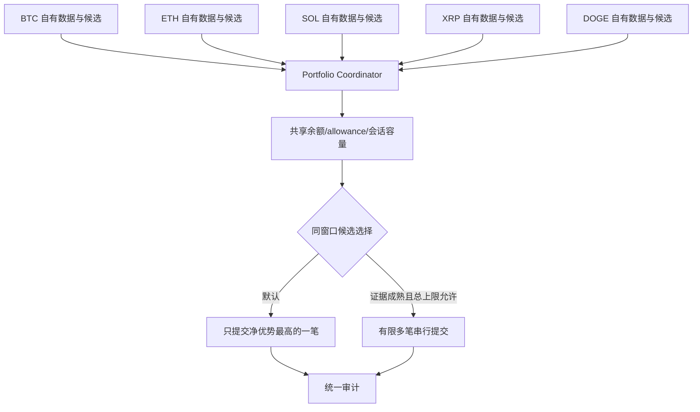

# 多币种 5 分钟 Up/Down 策略：BTC、ETH、SOL、XRP、DOGE

> 适用仓库：`/Users/gjy/polymarket-bot`
>
> 状态：BTC、ETH、SOL、XRP、DOGE 已完成独立市场、Chainlink 数据、模型和五资产轮询路径；2026-08-30 起在同一实盘会话中共享一次 POST 与 4.75 USDC 总资金上限。SOL、XRP、DOGE 的长期 Shadow 统计仍在持续积累。
>
> 基线文档：[`BTC_5MIN_STRATEGY_AND_FILE_MAP.md`](./BTC_5MIN_STRATEGY_AND_FILE_MAP.md)；ETH 迁移：[`ETH_5MIN_STRATEGY_PLAN.md`](./ETH_5MIN_STRATEGY_PLAN.md)。

## 1. 直接回答

**可以扩展到 ETH、SOL、XRP、DOGE 的五分钟盘口，但不能因为它们经常跟随 BTC，就把同一个 BTC 信号无条件复制成五笔订单。**

技术上正确的多资产策略是：

1. 每个资产读取自己的 Chainlink TWAP、spot、benchmark 和自己的 Polymarket 订单簿；
2. 每个资产独立计算终局概率与扣费后净优势；
3. 每个资产独立完成连续确认；
4. 所有资产共享一个全局资金、POST 次数和相关风险上限；
5. 当前五资产实盘会话只执行第一笔独立通过连续确认的候选；共享原子容量保证整场最多一次 POST。每轮轮换资产评估顺序，避免固定偏向。

仅用 BTC 信号交易其他币种是一个新的“跨资产代理信号”策略，不是现有 BTC 策略的自然复制。它必须单独回测和影子验证。

## 2. 当前存在的五分钟系列

2026-08-28 实测 Gamma 当前窗口存在并接受订单的资产：

| 资产 | slug 模式 | Chainlink 结算流 |
|---|---|---|
| BTC | `btc-updown-5m-<epoch>` | `btc-usd-twap-60s-streams` |
| ETH | `eth-updown-5m-<epoch>` | `eth-usd-twap-60s-streams` |
| SOL | `sol-updown-5m-<epoch>` | `sol-usd-twap-60s-streams` |
| XRP | `xrp-updown-5m-<epoch>` | `xrp-usd-twap-60s-streams` |
| DOGE | `doge-updown-5m-<epoch>` | `doge-usd-twap-60s-streams` |

市场发现入口：

```text
https://gamma-api.polymarket.com/markets?slug=<asset>-updown-5m-<epoch>
```

最近已结算事件的证据入口：

```text
https://gamma-api.polymarket.com/events?series_id=<series-id>&closed=true&limit=100&order=endDate&ascending=false
```

本次使用的系列 id：BTC `10684`、ETH `10683`、SOL `10686`、XRP `10685`、DOGE `11325`。

## 3. “都跟盘 BTC”到底有多一致

### 3.1 实测结果

2026-08-28 15:23 UTC 抽取每个系列最近 100 个已结算事件；按共同五分钟 epoch 取交集，得到 99 个窗口，覆盖 2026-08-28 07:00–15:10 UTC。

与 BTC 最终 Up/Down 结果一致率：

| 资产 | 与 BTC 同方向 | 共同窗口 | 一致率 | 与 BTC 不同方向 |
|---|---:|---:|---:|---:|
| ETH | 87 | 99 | 87.9% | 12.1% |
| XRP | 82 | 99 | 82.8% | 17.2% |
| DOGE | 79 | 99 | 79.8% | 20.2% |
| SOL | 78 | 99 | 78.8% | 21.2% |

五个资产全部同方向只有 `62/99 = 62.6%`。

这组短期样本确认了两个事实：

- 方向确实高度相关；
- 相关绝不等于相同。即使最接近的 ETH，也有约 12% 的窗口与 BTC 最终方向相反；SOL 约 21% 相反。

该统计只描述已结算方向一致率，不是策略准确率，也不是可交易收益率。它没有包含信号出现条件、盘口价格、手续费、滑点和确认延迟，不能直接证明任何跨资产订单具有正期望。

### 3.2 为什么五分钟二元结果会分叉

这些市场判断的是每个资产相对于**自己的**五分钟前基准是否上涨，不是比较美元绝对价格，也不是比较收益率大小。即使 BTC 与 ETH 的连续收益高度相关，只要各自在零收益线两侧，就会出现一个 Up、另一个 Down。

例子：

```text
BTC 五分钟收益 +0.02%  -> Up
ETH 五分钟收益 -0.01%  -> Down
```

两者都可能受到同一宏观冲击，但微小的资产特有噪声、流动性和时点差异足以改变二元结果。越接近开盘基准，跨资产复制方向越危险。

## 4. 三种策略必须分开

### 4.1 独立单资产策略

每个资产独立运行现有数学框架：

```text
p_up_asset = P(asset 终局 TWAP >= asset benchmark | asset 数据)
net_edge_asset = 方向概率 - asset ask - asset fee - execution reserve
```

这是最直接、可审计的扩展。BTC 只使用 BTC 数据，ETH 只使用 ETH 数据，以此类推。

### 4.2 多资产组合执行

同一时刻计算五个资产，但不必五个都下单。组合层收到每个资产已经独立确认的候选后，再做全局选择：

- 过滤未达到各自净优势阈值的候选；
- 检查每个订单簿可成交深度和价格上限；
- 把同一五分钟窗口视为一个高度相关风险簇；
- 使用共享余额快照和原子容量预留；
- 默认选净优势最高的一笔；
- 若允许多笔，全部订单最大损失之和必须在同一会话总上限内；
- 任一提交状态未知时冻结剩余组合，不继续并发 POST。

这是未来真正可控的多币种方案。

### 4.3 BTC 跨资产代理信号

规则类似：BTC 出现 Up 信号时，同时买 ETH/SOL/XRP/DOGE Up。该方案目前没有足够证据，原因：

- 12%–21% 的共同窗口最终方向与 BTC 相反；
- 尚未计算“BTC 信号出现时”的条件一致率；
- 尚未比较代理概率与每个目标盘口 ask；
- 每个市场手续费和深度不同；
- 多笔同方向订单放大的是同一个模型错误，而不是五个独立机会；
- 当前一个 BTC 假信号若复制到五个盘口，可能同时造成多笔损失。

因此它只能先作为独立的 Shadow 策略记录，不能复用 `chainlink_terminal_spot_v7` 的策略 id 或现有 BTC 授权。

## 5. 推荐的执行结构



### 5.1 为什么不是五个独立进程直接跑

当前每个进程的 `CapacityBudget` 只知道自己的会话。五个进程可能同时读取同一余额和 allowance，并各自认为资金足够，形成竞态：

```text
进程 A 看到余额 10
进程 B 也看到余额 10
A 预留 7，B 也预留 7
组合风险实际变成 14，而不是预期的 7
```

因此多资产实盘需要一个共享、原子、失败关闭的组合容量协调器。没有它时，只能保证同时最多一个资产会话具有 POST 资格。

### 5.2 串行而非并发 POST

即使同一窗口允许多笔，也应先串行：

1. 选出第一候选；
2. 重新检查全部账户和市场状态；
3. POST 并确认明确回执；
4. 用实际成交支出更新共享容量；
5. 重新评估第二候选是否仍满足阈值和预算；
6. 状态未知则停止。

并发 POST 会让总支出、余额、allowance 和失败恢复变得不可确定。

## 6. 各资产策略文档模板

SOL、XRP、DOGE 应按 ETH 文档同一结构建立各自配置，而不是复制代码：

| 资产 | 目标 strategy id 示例 | 必需独立证据 |
|---|---|---|
| ETH | `chainlink_terminal_eth_spot_v1` | ETH TWAP/spot、波动率、盘口、确认存活和结算 |
| SOL | `chainlink_terminal_sol_spot_v1` | SOL TWAP/spot、波动率、盘口、确认存活和结算 |
| XRP | `chainlink_terminal_xrp_spot_v1` | XRP TWAP/spot、波动率、盘口、确认存活和结算 |
| DOGE | `chainlink_terminal_doge_spot_v1` | DOGE TWAP/spot、波动率、盘口、确认存活和结算 |

版本名只是规划示例，代码注册前不代表已存在。

每份资产配置至少需要：

```text
asset
market_slug_prefix
market_family
chainlink_twap_stream_url
chainlink_http_feed_id
chainlink_ws_product_id
chainlink_ws_market_id
spot_symbol
model_version
minimum_net_edge
required_confirmations
execution_reserve
maximum_order_debit
maximum_session_debit
```

所有 feed 标识必须从对应官方源验证。禁止未知资产回退到 BTC 默认值。

## 7. 跨资产 Shadow 需要记录什么

每个五分钟窗口，对五个资产同步记录：

- epoch、asset、market id、token id；
- 各自 benchmark、TWAP、spot 和波动率；
- 各自 Up/Down best ask 与可成交深度；
- 各自 terminal probability、fee、gross edge、net edge；
- 第 1–5 次确认时间和存活状态；
- BTC 信号是否存在及方向；
- 自资产信号是否存在及方向；
- 官方 winner；
- 若按当时 book 模拟下单，估算成交价格和扣费后结果。

必须分别回答：

1. `P(目标资产 winner = BTC 信号方向 | BTC 信号通过 N 次确认)`；
2. `P(目标资产 winner = 自资产信号方向 | 自资产信号通过 N 次确认)`；
3. 两种方法在相同可成交盘口和手续费下的净收益分布；
4. 多资产同时触发时的联合最大回撤；
5. 选一笔与全下单的结果差异。

只有方向一致率不够；真正验收指标必须包含当时可成交价格和全部成本。

## 8. 分阶段落地

### 阶段 1：资产泛化（已完成）

- `official_chainlink.py` 和 `public_data.py` 已使用显式资产标识；
- ETH、SOL、XRP、DOGE 的 HTTP/WS 标识各自绑定；
- BTC 原有路径保持不变；
- 策略在资产不匹配时失败关闭。

### 阶段 2：五资产 Shadow（实现完成，统计持续积累）

- 五个资产均生成各自的审计记录；
- 每个资产使用自己的 Chainlink spot、终局概率和盘口；
- 连续确认次数使用同一个已验证状态机，不中途调参数。

### 阶段 3：单资产轮流小额实盘（已完成）

- BTC 已取得实盘成交与结算样本；
- ETH 已完成独立 Shadow，未复用 BTC 信号；
- 每个资产使用各自绑定市场族和模型版本的子授权。

### 阶段 4：五资产共享容量（已启用）

- 五个资产各自读取官方 Chainlink 数据和自己的 Polymarket 订单簿；
- 五个 `LiveRunner` 各自维护连续确认状态；
- 所有 runner 共享一个 `SessionCapacityLedger`：整场总最大支出和 POST 次数只有一份；
- 第一笔独立确认且通过最终快照复核、临发单盘口复核的候选消耗容量；程序随即停止；
- 每个轮询周期轮换五个资产的先后顺序；
- 未采用“同一窗口多笔”或 BTC 代理其他资产信号。

### 阶段 5：有限多笔

当前不启用。同一会话多笔仍需额外的相关风险上限、余额竞态与部分成交验证。

## 9. 当前决策

| 问题 | 当前答案 |
|---|---|
| ETH/SOL/XRP/DOGE 是否有五分钟盘口 | 有；本次查询均存在活跃系列 |
| 能否复用 BTC 的软件骨架 | 能 |
| 能否直接复用 BTC 数据和信号 | 不能 |
| 五个资产能否同时监控 | 能；各自使用独立数据、模型和确认状态 |
| 五个资产能否在同一会话各下一笔 | 不能；共享容量限定整场最多一次 POST |
| 多个资产同时出信号时怎么选 | 第一笔独立完成确认并通过最终复核的候选执行；轮询先后每轮轮换 |
| SOL/XRP/DOGE 当前状态 | 独立数据与策略路径已运行；长期 Shadow 统计继续写入审计文件 |
| BTC 代理策略怎么办 | 作为独立实验记录条件准确率和扣费后结果，不进入当前实盘授权 |

核心原则：**高度相关的盘口不是多份独立优势，而是一组可能同时正确、也可能同时出错的相关风险。**
